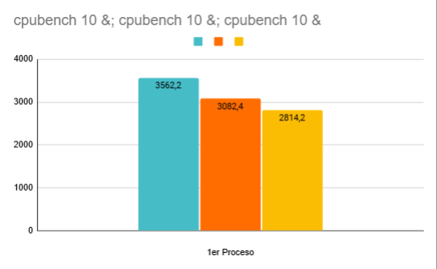

# Informe: sobre Planificador De Procesos
  
**Materia:** Sistemas Operativos - FaMAF - UNC
**Grupo:** Grupo 41
**Autores:** Facundo Gabriel Garione Chávez
Luis Bautista Córdoba Buffa
Malena Bustamante
Santino Bianco Monasterio
**Fecha:** 31/10/2024
  
## Introducción
 
### Objetivos
  
El planificador apropiativo de `xv6-riscv` utiliza un algoritmo sencillo para distribuir tiempo de procesador entre los procesos en ejecución, pero esto tiene un costo aparejado. Los objetivos de este laboratorio son:
  
- Estudiar el funcionamiento del scheduler original de xv6-riscv
  
- Analizar los procesos que se benefician/perjudican con esta decisión de diseño
 
- Desarrollar una implementación reemplazando la política de planificación por una propia que deberá respetar ciertas condiciones
  
Analizar cómo la nueva política afecta a los procesos en comparación con el planificador original
 
## Planificador Original de `xv6-riscv`
  
### Primera Parte: Estudiando el planificador de xv6-riscv
  
### Política de planificación
 
***¿Qué política de planificación utiliza "xv6-riscv" para elegir el próximo proceso a ejecutarse?***
  
Xv6-riscv utiliza una política de planificación **Round Robin (RR)** para elegir el próximo proceso a ejecutarse. Esta política es una de las más simples: cada proceso se ejecuta en orden, uno después del otro, durante un intervalo de tiempo determinado. Analizando en el código, en el archivo `proc.c` podemos ver como se define varias funciones y estructuras relacionadas con la gestión de procesos y su interacción con la CPU y la memoria.
  
### Estados de los procesos
  
***¿Cuáles son los estados en los que un proceso puede permanecer en xv6-riscv y qué los hace cambiar de estado?***
  
En xv6-riscv, un proceso puede estar en los siguientes estados principales:
Unused, Used, Sleeping, Runnable, Running y Zombie.

  

1.  ***Unused*** -> El proceso no está siendo utilizado, se lo inicializa en la función procinit colocandolo en este estado.

2.  ***Used*** -> El proceso está siendo creado, la función allocproc busca un proceso en estado Unused y lo pone en estado Used.

3.  ***Sleeping*** -> El proceso está esperando a que ocurra un evento, como la finalización de una operación de I/O. Las interrupciones por I/O llaman a sleep que cambia el estado del proceso a Sleeping.

4.  ***Runnable*** -> El proceso está listo para ejecutarse, pero está esperando que la CPU lo seleccione. En la función userinit se pone el proceso en Runnables y las interrupciones por timer llaman a yield que pasa el proceso de Running a Runnable. Además la función wakeup lo pasa a estado Runnable nuevamente, la función kill encargada de matar un proceso también hace esto. Cuando se llama a fork también pone en estado Runnable al proceso hijo.

5.  ***Running*** -> El proceso se está ejecutando en la CPU. El scheduler verifica si el proceso a correr está en estado Runnable y si es así, lo pone en estado Running.

6.  ***Zombie*** -> El proceso ha terminado, pero su información aún no ha sido recolectada por su proceso padre. La función exit pone el proceso que la llamó en estado Zombie hasta que el padre llama a wait, luego se desaloja el proceso.

  

### Quantum
  
***¿Qué es un quantum? ¿Dónde se define en el código? ¿Cuánto dura un quantum en xv6-riscv?***
  
Un quantum es el intervalo de tiempo durante el cual un proceso puede ejecutarse en la CPU antes de ser interrumpido y dar paso a otro proceso en sistemas que usan planificación de tipo Round Robin. Si un proceso no termina dentro de su quantum, es "suspendido" y se le otorga a otro proceso un turno en la CPU.
  
En el código de xv6, el quantum está relacionado con el temporizador que genera interrupciones periódicas para forzar el cambio de proceso. El temporizador genera una interrupción de "tick" después de un cierto número de ciclos de CPU, lo que provoca que el planificador reevalúe qué proceso debe ejecutarse a continuación. Aunque el quantum no se define explícitamente en una sola variable llamada "quantum", el temporizador (timer) interrumpe la ejecución de los procesos de manera periódica para garantizar la alternancia. En `start.c` se define la función timerinit() responsable de configurar el temporizador en xv6 para que las interrupciones de temporizador ocurran periódicamente y permitan la planificación de procesos. Dura 1.000.000 de ciclos, aproximadamente 100 ms.
  
### Cambio de contexto
  
***¿En qué parte del código ocurre el cambio de contexto en `xv6-riscv`? ¿En qué funciones un proceso deja de ser ejecutado? ¿En qué funciones se elige el nuevo proceso a ejecutar? ¿El cambio de contexto consume tiempo de un *quantum*?***
 
en `xv6-riscv` ocurre cuando el sistema pasa de ejecutar un proceso a otro. Esto se hace en la función `scheduler()` en `proc.c`, y el cambio de contexto en sí se realiza con la función `swtch()`, que guarda el estado del proceso actual y carga el estado del siguiente. El contexto incluye información como el registro de la pila y el contador del programa, lo que permite que el sistema vuelva al proceso que estaba ejecutando previamente.
  
***Funciones en las que un proceso deja de ser ejecutado***:
  
La función **`sched()`**: Es responsable de dejar de ejecutar un proceso y llamar a `swtch()` para cambiar a otro proceso. Las funciones `yield()`,`sleep` y `exit` llaman a sched.
  
**`yield()`**: Invocada cuando un proceso decide ceder voluntariamente la CPU, lo cual puede ocurrir cuando termina su quantum o al esperar por un evento (por ejemplo, cuando se bloquea).
  
**`sleep()`**: Si un proceso necesita esperar por un evento o recurso, llama a sleep(), lo que lo pone en estado de SLEEPING y provoca un cambio de contexto.
 
***Funciones que eligen el nuevo proceso a ejecutar***:
  
La función **`scheduler()`**: Es la responsable de seleccionar el siguiente proceso que será ejecutado. Itera a través de la lista de procesos y elige uno en estado RUNNABLE.
  
***Consumo de tiempo durante el cambio de contexto***:
  
El cambio de contexto consume tiempo, pero este tiempo no se descuenta del quantum del proceso. El quantum solo considera el tiempo en que el proceso efectivamente está ejecutando instrucciones en la CPU.
  
### Segunda Parte: Medir operaciones de cómputo y de entrada/salida

#### Experimento 1  
***Descripción de los parámetros***
 
Los parámetros utilizados para este experimento son:

* iobench(int N): El parámetro N determina cuántas veces se realizarán las operaciones de entrada/salida (IO). Para este experimento, N tiene un valor de 10.

* cpubench(int N): El parámetro N indica cuántas veces se ejecutará el experimento de cómputo intensivo. Al igual que en el caso de iobench, el valor de N es 10.
  
Para responder esta pregunta realizamos los siguientes experimentos:
* iobench 10 &; iobench 10 &; iobench 10 &
* cpubench 10 &; cpubench 10 &; cpubench 10 &
* iobench 10 &; cpubench 10 &; cpubench 10 &; cpubench 10 &
* cpubench 10 &; iobench 10 &; iobench 10 &; iobench 10 &
  
1. Ejecución de 3 procesos IO-bound (iobench)
```
iobench 10 &; iobench 10 &; iobench 10 &
```
El siguiente grafico muestra los ticks consumidos por 3 procesos iobench:

  
Podemos observar que los procesos IO-bound (iobench) presentan una variabilidad en el tiempo de ticks consumidos. Esto refleja que los procesos iobench son interrumpidos con mayor frecuencia por operaciones de entrada/salida, lo cual provoca que se divida de manera más irregular el uso del CPU.
Entonces podemos concluir que aunque los tres procesos comienzan en tiempos muy cercanos, su rendimiento varía considerablemente debido a la naturaleza IO-bound.
  
2. Ejecución de 3 procesos CPU-bound (cpubench)
```
cpubench 10 &; cpubench 10 &; cpubench 10 &
```
El siguiente grafico muestra los ticks consumidos por 3 procesos cpubench:

En este caso observamos que los procesos CPU-bound (cpubench) muestran un uso más equilibrado de los ticks. Cada proceso consume un tiempo muy similar en cada intervalo, lo que refleja que los procesos CPU-bound aprovechan más eficientemente el uso continuo del CPU.
Concluimos que los procesos cpubench no experimentan tantas interrupciones como los iobench, lo que hace que todos finalicen de forma más predecible y consistente.
  
3. Ejecución de 1 iobench y 3 cpubench
```
iobench 10 &; cpubench 10 &; cpubench 10 &; cpubench 10 &
```
El siguiente grafico muestra los ticks consumidos por 1 proceso iobench y 3 procesos cpubench:

Aunque el proceso iobench comienza al mismo tiempo que los procesos cpubench, los procesos cpubench son más eficientes y terminan antes. El proceso iobench consume muchos más ticks debido a las interrupciones de IO, y su ejecución es significativamente más larga.
Los procesos cpubench dominan el uso de la CPU, y el proceso iobench, aunque empieza al mismo tiempo, queda rezagado por su naturaleza dependiente de operaciones IO.
  
4. Ejecución de 1 cpubench y 3 iobench
```
cpubench 10 &; iobench 10 &; iobench 10 &; iobench 10 &
```
El siguiente grafico muestra los ticks consumidos por 1 proceso cpubench y 3 procesos iobench:

Aca podemos ver que el proceso cpubench comienza junto con los tres procesos iobench. Aunque el proceso cpubench ocupa menos ticks y finaliza antes, los procesos iobench muestran una mayor variabilidad en su tiempo de ejecución y tardan considerablemente más en completarse debido a las operaciones de entrada/salida.
El proceso cpubench es el primero en terminar, mientras que los procesos iobench, al tener más interrupciones, consumen más tiempo total de CPU.
  
***¿Se ejecutan los procesos en paralelo?***
  
Sí, los procesos se ejecutan en paralelo en todos los casos. Esto se observa en los datos donde los procesos comienzan en tiempos muy cercanos y se reparten el tiempo de CPU.
  
***¿Qué procesos se ejecutan primero en promedio?***
  
En general, los procesos cpubench (CPU-bound) tienden a ejecutarse primero y a completar su ejecución de manera más eficiente y lineal. Los procesos iobench (IO-bound), por otro lado, presentan más variabilidad en su tiempo de ejecución, debido a las interrupciones generadas por las operaciones de entrada/salida, lo que los hace más lentos en promedio.
 
En los gráficos se refleja cómo los procesos cpubench aprovechan mejor el uso del CPU, mientras que los procesos iobench se ven afectados por las operaciones de entrada/salida, resultando en tiempos de ejecución más largos y variables.
 
**¿Cambia el rendimiento de los procesos iobound con respecto a la cantidad y tipo de procesos que se estén ejecutando en paralelo? ¿Por qué?**

-  **Más procesos en paralelo:** 

En este caso, los procesos iobench tienen un rendimiento más alto porque liberan rápidamente la CPU al entrar en espera de I/O, permitiendo que otros procesos avancen sin mucha competencia. Promedio de ticks por operación: ~6 ticks

  

-**Diferentes tipos de procesos en paralelo:** 

El rendimiento de los procesos iobench empeora drásticamente. El tiempo de ejecución de un bloque puede llegar a 3029 ticks. Los procesos cpubench ocupan la CPU durante más tiempo, lo que incrementa la latencia de las operaciones I/O. Aunque los procesos iobench solo requieren breves ráfagas de CPU, deben esperar mucho más tiempo para recibirlas.
  
**¿Cambia el rendimiento de los procesos cpubound con respecto a la cantidad y tipo de procesos que se estén ejecutando en paralelo? ¿Por qué?**

-  **Más procesos en paralelo:** Promedio de ticks por operación: ~279-300 ticks. La competencia entre varios procesos cpubench obliga al sistema a realizar muchos cambios de contexto, reduciendo el tiempo efectivo que cada proceso tiene en la CPU.

-**Diferentes tipos de procesos en paralelo:** Cuando hay procesos iobench en paralelo, los procesos cpubench obtienen más tiempo de CPU, ya que los procesos iobench liberan rápidamente la CPU. Esto mejora el rendimiento de los procesos cpubench en comparación con el escenario donde hay muchos procesos cpubench en paralelo.
  
**¿Es adecuado comparar la cantidad de operaciones de cpu con la cantidad de operaciones iobound?**
  
No es del todo adecuado comparar directamente la cantidad de operaciones porque:
Las operaciones iobound dependen en gran medida de la disponibilidad de dispositivos de entrada/salida (disco, red, etc.), en cambio las operaciones cpubound son operaciones de cómputo que dependen directamente del tiempo de CPU.
Las operaciones de i/o suelen ser más rápidas en completar porque liberan la CPU, lo que permite que otros procesos se ejecuten. En cambio, las operaciones cpubound suelen usar la CPU por períodos más largos sin liberarla.

### Experimento 2: Cambios en el quantum

**Descripcion de parametros:**

En este experimento modificamos el quantum, es decir el tiempo de CPU. Dado que el experimento inicial tiene un quantum de 100.000 ticks, ahora compararemos el comportamiento reducido a 10.000 y 1.000 ticks.

**Resultados:**

**Quantum 10000**





**Quantum 1000**


  
**1. ¿Fue necesario modificar las métricas para que los resultados fueran comparables? ¿Por qué?**

Sí, fue necesario modificar las métricas para mantener consistencia en la comparación entre experimentos.
Al reducir el quantum, el número de cambios de contexto aumenta significativamente, lo cual afecta las cantidades de operaciones por tick. 
Cuando achicamos el quantum a 10000 tuvimos que multiplicar por 10 a total_iops y total_cpu_kops en iobench y cpubench respectivamente.
cuando achicamos el quantum a 1000 tuvimos que multiplicar por 100 a total_iops y total_cpu_kops en iobench y cpubench respectivamente.

Sin ajustar las métricas, los resultados de los experimentos no serían comparables, ya que los procesos habrían completado menos operaciones en un quantum más corto.

**2. ¿Qué cambios se observan con respecto al experimento anterior? ¿Qué comportamientos se mantienen iguales?**

 **Con Quantum de 100,000 (Experimento anterior)**

Con un quantum de 100,000 ticks, los procesos CPU-bound muestran una alta eficiencia, aprovechando al máximo el tiempo de CPU sin interrupciones frecuentes. La baja frecuencia de cambios de contexto permite que estos procesos realicen más operaciones de manera continua.

-   **Métrica promedio de cpubench**: 2780.55
-   **Métrica promedio de iobench**: 5.3

La métrica de `cpubench` refleja la alta eficiencia de los procesos CPU-bound bajo este quantum extenso. Los procesos I/O-bound, sin embargo, experimentan una mayor latencia, ya que los procesos CPU-bound monopolizan la CPU por largos períodos, provocando que los I/O-bound queden en espera la mayor parte del tiempo, como lo muestra su baja métrica de `iobench`.

**Con Quantum de 10,000**

Al reducir el quantum a 10,000 ticks, se incrementa la frecuencia de cambios de contexto, lo que afecta la eficiencia de los procesos CPU-bound. Las métricas de `cpubench` e `iobench` fueron multiplicadas por 10 para que los resultados fueran comparables con los de los otros quanta.

-   **Métrica promedio de cpubench**: 2844.06 (ajustada por un factor de 10)
-   **Métrica promedio de iobench**: 2.61 (ajustada por un factor de 10)

La métrica de `cpubench` sugiere que, aunque los procesos CPU-bound mantienen un buen rendimiento, la eficiencia ha disminuido en comparación con el quantum de 100,000 debido a las interrupciones más frecuentes. Los procesos I/O-bound, en cambio, se benefician levemente de esta mayor frecuencia de cambios de contexto, ya que obtienen acceso a la CPU con mayor regularidad, lo cual mejora su rendimiento

**Con Quantum de 1,000 Ticks**

Con un quantum de 1,000 ticks, el elevado número de cambios de contexto afecta severamente la eficiencia de los procesos CPU-bound, que experimentan interrupciones constantes. Para comparar los resultados, tanto `cpubench` como `iobench` se multiplicaron por 100.

-   **Métrica promedio de cpubench**: 7443.5 (ajustada por un factor de 100)
-   **Métrica promedio de iobench**: 9.225 (ajustada por un factor de 100)

La métrica de `cpubench` demuestra cómo el rendimiento de los procesos CPU-bound se degrada con este quantum extremadamente corto. En cambio, los procesos I/O-bound aprovechan al máximo esta situación, obteniendo acceso rápido y frecuente a la CPU, lo que disminuye su tiempo de espera y mejora su rendimiento notablemente.

**¿Qué comportamientos se mantienen iguales?**


A lo largo de los distintos tamaños de quantum, se observaron ciertos comportamientos que se mantienen constantes:

-   Los procesos CPU-bound siempre dominan la CPU con quanta largos, logrando ejecutar muchas operaciones de manera continua y con gran eficiencia, aunque esto aumenta la latencia para los procesos I/O-bound.
    
-   La reducción en el tamaño del quantum provoca de forma constante un aumento en la frecuencia de cambios de contexto. Esto afecta la eficiencia de los procesos CPU-bound y facilita el acceso a la CPU para los procesos I/O-bound.

**3. ¿Con un quantum más pequeño se ven beneficiados los procesos I/O-bound o CPU-bound?**


-   En cada reducción de quantum, los procesos I/O-bound muestran una mejora de rendimiento, ya que acceden a la CPU con más frecuencia y se reduce su tiempo de espera, mejorando así su latencia.
    
-   La reducción en el tamaño del quantum impacta negativamente en la eficiencia de los procesos CPU-bound en todos los casos, interrumpiéndolos con mayor frecuencia y limitando su capacidad de completar operaciones de forma continua.


El tamaño del quantum tiene un impacto determinante en el rendimiento de los procesos CPU-bound e I/O-bound en xv6-riscv. Los procesos CPU-bound maximizan su eficiencia con quanta largos, mientras que los procesos I/O-bound se benefician con quanta cortos al reducirse su tiempo de espera. Estos comportamientos observados y los consistentes subrayan la importancia de ajustar el quantum en sistemas operativos para balancear la eficiencia de distintos tipos de procesos.


### Tercera Parte: Asignar prioridad a los procesos
En la implementación del MLFQ, se incorporaron reglas específicas para ajustar la prioridad de los procesos según su comportamiento:

* **Regla 3**: Al iniciar, un proceso recibe la prioridad máxima. En la función allocproc, se establece el nivel de prioridad en el más alto para facilitar su acceso a la CPU.

* **Regla 4**: Ajuste de prioridad basado en el uso del quantum:

    * Descenso de Prioridad: Un proceso que utiliza todo su quantum sin bloquearse disminuye su `queue_level`.
    * Ascenso de Prioridad: Si un proceso se bloquea antes de finalizar su quantum, su prioridad aumenta, mejorando su tiempo de respuesta en la próxima ejecución.
### Cuarta Parte: Implementación de MLFQ

* **Regla 1**: El planificador prioriza procesos de mayor prioridad. En `proc.c`, los procesos se organizan en colas por niveles de prioridad, usando `p->priority` para indicar su nivel. El planificador revisa las colas de mayor a menor y elige el primer proceso disponible.

* **Regla 2**: Para procesos de igual prioridad, se utiliza `p->times_scheduled` para seleccionar el que menos veces ha sido elegido. Esto asegura una distribución justa del tiempo de CPU.

### Experimentos con el Planificador MLFQ
Configuración de los experimentos:

* `iobench 10 &`
* `cpubench 10 &`
* `iobench 10 &; iobench 10 &; iobench 10 &`
* `cpubench 10 &; cpubench 10 &; cpubench 10 &`
* `iobench 10 &; cpubench 10 &; cpubench 10 &; cpubench 10 &`
* `cpubench 10 &; iobench 10 &; iobench 10 &; iobench 10 &`

#### Paralelismo y Ejecución de Procesos

**¿Se ejecutan los procesos en paralelo?**

Sí, a pesar de contar con una sola CPU, los procesos se ejecutan en paralelo mediante alternancia de tiempo de CPU, como se observa en los tiempos de inicio similares en los gráficos.

**¿Qué procesos se ejecutan primero en promedio?**

Los procesos CPU-bound generalmente terminan primero, ya que aprovechan la CPU sin tiempos de espera, a diferencia de los IO-bound, que deben esperar por operaciones de entrada/salida, aumentando así su tiempo de ejecución.


**¿Cambia el rendimiento de los procesos IO-bound con respecto a la cantidad y tipo de procesos que se estén ejecutando en paralelo? ¿Por qué?**

Sí, el rendimiento de los procesos IO-bound (iobench) cambia significativamente con respecto a la cantidad y tipo de procesos que se ejecutan en paralelo. Cuando hay múltiples procesos IO-bound en ejecución, la variabilidad en el tiempo de ticks consumidos aumenta (como se ve en `iobench 10 &; iobench 10 &; iobench 10 &`). Esto es resultado de la competencia por el acceso a recursos de E/S, que provoca que los procesos sean interrumpidos con mayor frecuencia y terminen tardando más en completar su ejecución.

Además, al ejecutar iobench junto a procesos CPU-bound (como en `iobench 10 &; cpubench 10 &; cpubench 10 &; cpubench 10 &`), el proceso IO-bound consumió 10,234 ticks, mucho más que los CPU-bound, que son más eficientes. Esto muestra que los procesos IO-bound se ven aún más afectados por la competencia, lo que lleva a una ejecución menos eficiente y más prolongada.


**¿Cambia el rendimiento de los procesos CPU-bound con respecto a la cantidad y tipo de procesos que se estén ejecutando en paralelo? ¿Por qué?**

El rendimiento de los procesos CPU-bound (cpubench) también cambia, pero en menor medida. Los procesos CPU-bound tienden a mantener un rendimiento más consistente incluso cuando se ejecutan en paralelo, como se observa en los resultados de `cpubench 10 &; cpubench 10 &; cpubench 10 &`, donde los ticks totales son relativamente cercanos entre sí. Esto se debe a que no están interrumpidos por operaciones de E/S, y su ejecución es más predecible. Sin embargo, cuando hay una mezcla de procesos CPU-bound y IO-bound, el rendimiento de los IO-bound se ve afectado negativamente.


**¿Es adecuado comparar la cantidad de operaciones de CPU con la cantidad de operaciones IO-bound?**

No es adecuado comparar directamente la cantidad de operaciones de CPU con las operaciones IO-bound. Esto se debe a que los procesos CPU-bound y IO-bound tienen diferentes características de rendimiento y dependen de distintos recursos del sistema. Los procesos CPU-bound están diseñados para utilizar intensivamente el CPU, mientras que los procesos IO-bound dependen de las operaciones de entrada/salida, lo que puede resultar en tiempos de ejecución muy diferentes. Por lo tanto, la comparación debe considerar el contexto de cada tipo de proceso.

**¿Se puede producir starvation en el nuevo planificador?** 

El MLFQ puede causar "starvation" o bloqueo prolongado en procesos de baja prioridad. Esto sucede cuando los procesos de alta prioridad acaparan la CPU, dejando a los de baja prioridad sin suficiente tiempo de ejecución. Esto podría pasar si siempre hay procesos de alta prioridad listos para ejecutarse.

#### Propiedades y Comportamientos Observados

**Uso de Ticks y Tipo de los Procesos:**


El planificador MLFQ utiliza más ticks que RR para la mayoría de los procesos, ya sean de entrada/salida (iobench) o de cómputo (cpubench).

Esto sugiere que MLFQ cambia de contexto más frecuentemente, lo cual es coherente con su diseño para alternar rápidamente entre procesos según sus prioridades y patrones de bloqueo/desbloqueo.

**Métrica de Rendimiento (ops/ticks):**


La métrica de rendimiento (operaciones por tick) es generalmente menor en MLFQ que en RR, indicando que los procesos completan menos operaciones en el mismo número de ticks. Esto se debe al tiempo adicional dedicado a cambios de contexto y a la penalización de procesos CPU-bound que consumen todo su quantum.

* Procesos CPU-bound: La métrica es considerablemente menor en MLFQ, reflejando una penalización mayor a estos procesos debido a su uso intensivo de CPU.

* Procesos IO-bound: La métrica también disminuye en MLFQ, pero no tanto como en los procesos CPU-bound, ya que estos procesos no consumen todo su quantum y reciben mayor prioridad.


### Experimento 2
**Resultados:**

**Quantum 10000**


.png)

.png)

.png)

.png)

.png)

.png)

.png)

.png)


**Quantum 1000**


.png)

.png)

.png)

.png)

.png)

.png)

.png)

.png)


**1. ¿Fue necesario modificar las métricas para que los resultados fueran comparables? ¿Por qué?**
si fue necesario modificar para obtener resultados comparables, realizamos los mismos cambios que en experimento 2.
Cuando achicamos el quantum a 10000 tuvimos que multiplicar por 10 a total_iops y total_cpu_kops en iobench y cpubench respectivamente.(metric = (total_iops*10) / elapsed_ticks; ) y (metric = (total_cpu_kops*10) / elapsed_ticks;)
cuando achicamos el quantum a 1000 tuvimos que multiplicar por 100 a total_iops y total_cpu_kops en iobench y cpubench respectivamente.(metric = (total_iops*100) / elapsed_ticks; ) y (metric = (total_cpu_kops*100) / elapsed_ticks;)

**2. ¿Qué cambios se observan con respecto al experimento anterior? ¿Qué comportamientos se mantienen iguales?**

Comparando los resultados con quantum de 1,000 y 10,000:

Para los procesos I/O-bound (iobench): Con quantum de 1,000, es menor el número de operaciones realizadas en cada intervalo, además de un aumento en los ticks de ejecución total. Sin embargo, en un quantum mayor, iobench mantiene un nivel de prioridad más alto durante períodos más largos, ya que realiza menos cambios de contexto. Los procesos I/O-bound se ven menos afectados cuando el quantum es mayor, manteniendo una prioridad alta sin descender rápidamente.

Para los procesos CPU-bound (cpubench): Al reducir el quantum a 1,000, estos procesos sufren más cambios de contexto, lo que reduce su rendimiento relativo (aumento de ticks y menor número de operaciones completadas en cada intervalo). Con quantum de 10,000, los procesos CPU-bound pueden realizar más operaciones antes de ceder la CPU, manteniendo mayor rendimiento general.

**3. ¿Con un quantum más pequeño, se ven beneficiados los procesos I/O-bound o los procesos CPU-bound?**

Con un quantum más pequeño (1,000), los procesos I/O-bound se benefician más. Esto se debe a que, en el MLFQ, estos procesos tienden a ceder la CPU antes de agotar su quantum, lo que les permite mantener niveles de prioridad altos. Los procesos CPU-bound, terminan descendiendo rápidamente en prioridad debido a su uso intensivo de CPU y agotan su quantum completo en cada turno, lo que lleva a más cambios de contexto y descensos de nivel.


**¿Se puede producir starvation en el nuevo planificador?**
Sí, es posible que ocurra starvation, aunque depende de la configuración de carga del sistema. En el MLFQ, los procesos I/O-bound, que tienden a bloquearse y liberan la CPU rápidamente, podrían permanecer en las prioridades más altas, obteniendo así un acceso más frecuente a la CPU. Los procesos CPU-bound, al consumir sus quanta completos y descender en prioridad, podrían terminar en la prioridad más baja y, en un sistema muy cargado, recibir menos tiempo de CPU.